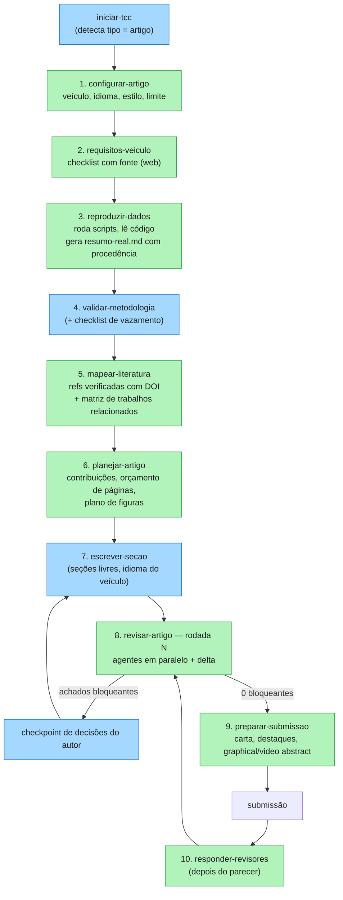

# Proposta — modo artigo do tcc-kit (fluxo focado em publicação)

**Data:** 2026-09-17
**Status:** Fase 1 implementada (v1.10 a v1.12, 2026-09-23). Fases 2 e 3 (modo artigo propriamente
dito) **adiadas** por decisão do autor; ver seção 0 antes de retomar.
**Base empírica:** [`docs/benchmarks/2026-09-17-artigo-ieee-latam.md`](../benchmarks/2026-09-17-artigo-ieee-latam.md)

---

## 0. Situação em 2026-09-23 (ler antes de retomar)

A Fase 1 saiu em três versões, todas valendo para o TCC hoje. Parte do que esta proposta previa para
o modo artigo já existe; o modo artigo em si (Fases 2 e 3) está adiado.

| Item da proposta | Onde está | Como ficou (e o que mudou em relação a esta proposta) |
|---|---|---|
| Relatório bruto em arquivo, 3 linhas de retorno (seção 4.2, regra 1) | v1.11 | Os 7 agentes ganharam `Write` só para o próprio relatório. Uma trava por hash (`estado_projeto.py foto`/`comparar`) confere que nada mais mudou. Isso revogou a decisão de 2026-08-23 de agentes sem `Write` |
| IDs estáveis (regra 2) | v1.11 | Linha de achado fixa: `- **<PREFIXO>-<NN>** · <NÍVEL> · "<trecho>" · <problema>`, prefixos `DADOS`, `CIT`, `LAC`, `MET`, `ORI`, `BANCA`, `FORMA`, `CONS`. A skill consolida por Grep |
| Data do artefato lido (regra 3) | v1.11 | Virou regra mais simples: log, PDF ou saída de script só vale como evidência se quem acionou disser que é da execução atual |
| Rodada N com delta e deduplicação (seção 6) | v1.11 | Em `revisar-capitulo`: cada agente recebe o próprio relatório anterior e marca RESOLVIDO / PARCIAL / PENDENTE; achado repetido entre agentes vira uma linha com os IDs juntos |
| Despacho em paralelo (seção 6) | v1.11 | Os 6 agentes na mesma mensagem; a prioridade dado → citação → resto só na consolidação |
| DOI e tipo BibTeX no `revisor-citacoes` | v1.11 | Ordem de fonte: Markdown local de `revisao-bibliografica` → Crossref (com `doi.org` para Zenodo/DataCite) → busca. DOI ausente, tipo errado e fonte que não sustenta a frase são APONTAMENTO, não bloqueante (no TCC ABNT o DOI não é obrigatório) |
| Checklist de vazamento no `guardiao-metodo` | v1.11 | Checklist de modelagem (vazamento, escolha no conjunto de avaliação, comparação justa, testes múltiplos, diagnósticos, reprodutibilidade) e leitura do script que gerou o número quando indicado |
| Cobertura no `guardiao-dados` (seção 4.2) | v1.11 | Seção `## Cobertura` com o que bateu |
| Backup e regra de git (seção 7) | v1.11 | `estado_projeto.py backup` para `tcc-kit/versoes/<momento>/` em `escrever-capitulo`, `escolher-template`, `gerar-diagrama` e `preparar-defesa`; git só leitura, nunca encadeado |
| `reproduzir-dados` (seção 4.1) | v1.12 | Skill **sem** o agente `reprodutor-dados`: roda na conversa principal porque precisa de duas confirmações do aluno (inventário e análise nova). Executa só scripts Python existentes, com `uv run`, foto e backup; MATLAB/R/C/firmware só leitura. Resumo com procedência por número e "O que não existe como dado" (que o `guardiao-dados` trata como BLOQUEANTE) |
| Resumo com procedência compartilhado (seção 5) | v1.12 | Continua em `tcc/dados/resumo-real.md` (não em `tcc-kit/dados/`); o registro das execuções fica em `tcc-kit/dados/reproducao.md` e o índice de materiais em `tcc-kit/dados/materiais.yaml` |
| Não estava na proposta | v1.10 | Registro de versões por hash (`tcc-kit/.estado.json`) e skill `estado-tcc`: sabe, sem reler o texto, quando revisão, auditoria, slides ou resumo de dados ficaram desatualizados |

**Números do benchmark que ainda valem como referência de custo:** 450 a 750 mil tokens por rodada
completa com os agentes devolvendo relatórios inteiros. Medição da v1.11 contra a v1.10 num capítulo
mínimo (`docs/benchmarks/2026-09-23-custo-revisao-v110-v111.md`): conversa principal 18% mais barata
(saída −36%), custo total −10%, agentes +31%. O ganho deve crescer com relatórios longos; a maior parte do
custo que sobra é contexto fixo da conversa principal (~650 mil tokens de cache lido).

**O que a Fase 2 ainda precisa, dado o que já existe:**

- Campo `Tipo de documento` e as pastas `artigos/<nome>/` (seção 5).
- `configurar-artigo`, `requisitos-veiculo`, `planejar-artigo`.
- `escrever-secao`: pouco além de `escrever-capitulo` com slug livre, que já existe, mais idioma do veículo.
- `revisar-artigo`: a orquestração de `revisar-capitulo` (paralelo, brutos, delta, trava) já é a da
  seção 6. Falta rodar sobre o documento inteiro, o checkpoint de decisões do autor com
  AskUserQuestion e `decisoes.md`, e o critério de parada.
- Perfis do `revisor-forma`, `revisor-periodico` (variação de `banca-critica`), `verificar-diagramacao`
  com o agente `revisor-diagramacao`.
- Checklist por seção livre: o esqueleto atual tem os 5 capítulos fixos repetidos em 10 skills; mudar
  isso é a parte mais trabalhosa.

## 1. Problema

O kit foi desenhado para um TCC: 5 capítulos fixos, ABNT, português, banca e defesa. No benchmark
com um artigo IEEE, os agentes funcionaram, mas o fluxo precisou de improviso em quase todas as
etapas:

- não há como montar o `resumo-real.md` a partir do projeto;
- as seções têm nome livre, e os slugs do kit são fixos;
- o artigo estava em inglês e seguia estilo IEEE;
- os requisitos do periódico mudam por veículo e precisam ser pesquisados;
- o DOI é obrigatório nas referências;
- existe uma rodada de revisão por pares no lugar da banca;
- o pacote de submissão (carta, graphical abstract, vídeo) substitui a defesa.

O público do curso também escreve artigos, com frequência a partir do próprio TCC, e é aí que o
risco de "número inventado" cresce: o texto é reescrito longe dos dados originais.

## 2. Decisão proposta

**Um modo artigo dentro do mesmo plugin (v2.0), e não um plugin separado.**

| Opção | A favor | Contra |
|---|---|---|
| **A. Modo artigo no tcc-kit** (recomendada) | Reaproveita os 7 agentes; um único `resumo-real.md` serve TCC e artigo; o aluno não instala outra coisa; as melhorias (DOI, vazamento, diagramação) também beneficiam o TCC | As skills ficam com mais ramificações (`se tipo = artigo…`) |
| B. Plugin irmão `artigo-kit` | Skills mais simples, nome claro | Duplica agentes e correções; dois lugares para manter; aluno com TCC e artigo instala dois kits |

O modo é escolhido em `tcc-kit/config.md` com o campo `Tipo de documento: tcc | artigo`. Um projeto
pode ter um TCC e artigos derivados, cada documento com sua pasta (seção 5).

## 3. Fluxo



**Critério para sair do laço de revisão:**

- nenhum achado bloqueante de dados ou citações;
- nenhum item obrigatório do veículo pendente que dependa do kit;
- risco simulado de rejeição sem revisão no máximo "médio";
- as pendências restantes dependem só do autor.

## 4. Componentes

### 4.1 Skills

| Skill | Novo / adaptado | O que faz | Motivação no benchmark |
|---|---|---|---|
| `configurar-artigo` | Novo (ou ramo de `configurar-projeto`) | Veículo, tipo (pesquisa, revisão, short), idioma do corpo e dos metadados, template, estilo de referência, limite de páginas, autores e ORCID, documento-fonte (ex.: o TCC) | O config não tinha nenhum desses campos |
| `requisitos-veiculo` | Novo (substitui o checklist institucional) | Pesquisa as instruções do veículo, grava `tcc-kit/veiculo.md` com um item por linha e a URL da fonte; marca "não confirmado" quando não achar | Revelou 7 exigências que o plano do autor não tinha |
| `reproduzir-dados` | **Novo, prioritário** | Localiza dados e scripts, executa os scripts, lê o código com perguntas dirigidas (versão que gerou os dados, parâmetros, unidades) e grava o `resumo-real.md` com procedência por linha e uma seção "o que não existe como dado" | As 7 descobertas que mudaram o artigo (benchmark, seção 5.3) |
| `validar-metodologia` | Adaptado | + paradigma "experimental/computacional"; checklist de vazamento, seleção de hiperparâmetros, comparação justa e repetibilidade | O vazamento só foi pego na rodada 2 |
| `mapear-literatura` | Adaptado de `revisao-bibliografica` | Busca, verifica e indexa como hoje, com DOI obrigatório via Crossref e tipo BibTeX correto; gera uma matriz "trabalho × o que oferece × o que não oferece" para a seção de trabalhos relacionados | Autoria errada, entradas sem DOI, diferenciação ausente |
| `planejar-artigo` | Novo (ramo de `planejar-capitulo`) | Frase de contribuição, lista de contribuições verificáveis, estrutura de seções, orçamento de páginas por seção, plano de figuras e tabelas (cada uma ligada a um script) | As contribuições não eram entregues pelo texto; figuras sem script |
| `escrever-secao` | Adaptado de `escrever-capitulo` | Slugs livres, idioma do veículo, estilo do perfil, grounding igual ao atual; faz backup em `versoes/` antes de sobrescrever | Reescrita em inglês com 7 seções |
| `revisar-artigo` | Adaptado de `revisar-capitulo` | Rodada N sobre o documento inteiro, agentes em paralelo, ordem aplicada só na consolidação, deduplicação, delta com a rodada anterior e estado por seção | Rodada 2 foi o recurso de maior valor; consolidação manual e repetitiva |
| `verificar-diagramacao` | Novo | Compila do zero, conta páginas contra o limite, lê o log **desta** compilação (erros, caixas estouradas, referências indefinidas), renderiza as páginas e confere se os DOIs aparecem nas referências | Problemas visuais e DOI invisível só foram vistos renderizando; log antigo gerou falso positivo |
| `espelhar-traducao` | Novo, opcional | Compara duas versões (PT × EN) em números, conteúdo e termos | 3 divergências PT × EN na rodada 1 |
| `preparar-submissao` | Novo (substitui `preparar-defesa`) | Rascunho da carta ao editor (originalidade, trabalhos prévios, CRediT, revisores sugeridos como campos a preencher, divulgação de IA), destaques, briefing do graphical abstract, roteiro do video abstract, declaração de disponibilidade de dados; nunca inventa revisor, financiamento ou uso de IA | Carta escrita à mão; itens obrigatórios esquecidos |
| `responder-revisores` | Novo (fase 3) | Recebe o parecer, cria a tabela comentário → resposta → mudança → local, dispara `revisar-artigo` nas seções alteradas | Próximo passo natural depois da submissão |

### 4.2 Agentes

| Agente | Mudança |
|---|---|
| `guardiao-dados` | Ler a procedência do `resumo-real.md`; tratar como achado uma afirmação específica que o resumo marca como "não registrado"; listar a cobertura (o que bateu), não só as divergências; tolerância de arredondamento explícita; conferir também legendas, tabelas e figuras TikZ |
| `revisor-citacoes` | Conferir DOI na Crossref (`api.crossref.org/works/<doi>`); conferir tipo BibTeX × estilo (ex.: `@article` sem `journal` no IEEEtran); conferir se a fonte sustenta a frase citada; entregar candidatas só com DOI conferido |
| `guardiao-metodo` | Checklist por tipo de estudo. Quantitativo e modelagem: vazamento, escolha no conjunto de teste, comparação justa (mesmo tratamento para todos os modelos), testes múltiplos, resíduos e diagnósticos, reprodutibilidade. Sempre conferir o script que gerou o número, quando existir |
| `orientador-rigoroso` | + verificar se cada contribuição da introdução é entregue e onde; exigir a frase de ineditismo; sinalizar "contribuição" que é só correção de bug |
| `banca-critica` | No modo artigo, virar `revisor-periodico`: desk-review com nível de risco, 3 revisores por área, top 5 mudanças, separação entre "respondível com os dados atuais" e "exige experimento novo" |
| `revisor-forma` | Perfis de estilo: `abnt-pt`, `ieee-en`, `apa-en`, `sbc-pt`…; lista de tiques de IA por idioma; regras de LaTeX (subscritos em `\mathrm`, pontuação de equações, símbolo reaproveitado) |
| `guardiao-consistencia` | + resumo × corpo, legenda × texto, tabela × texto, figura TikZ × texto; opcionalmente PT × EN |
| **`revisor-diagramacao`** (novo) | Usado por `verificar-diagramacao`; lê as páginas renderizadas e o log atual; nunca edita |
| **`reprodutor-dados`** (novo) | Usado por `reproduzir-dados`; executa scripts em ambiente isolado (`uv run --with …`), registra comando, saída e commit; nunca altera dados brutos |

**Regras comuns a todos os agentes (vale também para o modo TCC):**

1. **Gravar o relatório bruto** em `relatorios/_brutos/<rodada>/<agente>.md` e devolver só um resumo
   de 3 linhas. Isso resolve o retorno truncado e a consolidação manual.
2. **Cada achado com identificador estável** (`DADOS-07`, `MET-03`…), para o delta entre rodadas.
3. **Declarar a data e a hora do artefato lido** quando ler algo gerado (log, PDF), para não usar
   arquivo velho.

## 5. Estrutura de arquivos

```text
projeto/
├── tcc/                          # TCC (modo atual)
├── artigos/
│   └── ieee-latam-2026/          # um diretório por artigo
│       ├── main.tex, secoes/, figuras/, referencias.bib
│       ├── submissao/            # carta, destaques, graphical abstract
│       └── versoes/              # backups antes de cada reescrita
└── tcc-kit/
    ├── config.md                 # Tipo de documento: tcc | artigo; documento ativo
    ├── dados/
    │   ├── resumo-real.md        # compartilhado entre TCC e artigos
    │   └── reproducao.md         # comandos, saídas e commits (reproduzir-dados)
    ├── metodologia.md
    ├── referencias/index.yaml    # já existe; + doi_verificado: true/false
    └── artigos/ieee-latam-2026/
        ├── veiculo.md            # requisitos com fonte
        ├── plano.md              # contribuições, seções, orçamento de páginas, figuras
        ├── decisoes.md           # checkpoint de decisões do autor
        ├── checklist.md          # estado por seção + itens do veículo
        ├── historico.md
        └── relatorios/
            ├── rodada-1-AAAA-MM-DD.md
            ├── rodada-2-AAAA-MM-DD.md
            └── _brutos/rodada-N/<agente>.md
```

**Esqueleto do checklist no modo artigo:**

```markdown
# Checklist — <artigo>

## Veículo
- [ ] Requisitos levantados (veiculo.md) — N itens, M pendentes

## Dados
- [ ] resumo-real.md com procedência (reproduzir-dados)

## Literatura
- [ ] Referências verificadas com DOI: X de Y

## Seções
| Seção | Estado |
|---|---|
| <slug livre> | Não iniciado / Planejado / Escrito / Revisado (rodada N), com ou sem bloqueantes |

## Diagramação
- [ ] Páginas: P (limite L) — compilação sem erros

## Submissão
- [ ] Carta  - [ ] Destaques  - [ ] Graphical abstract  - [ ] Video abstract  - [ ] Revisores sugeridos
```

## 6. Orquestração da `revisar-artigo`

1. **Pré-condições.** `resumo-real.md` existe (senão, sugerir `reproduzir-dados`), `veiculo.md`
   existe e o documento compila.
2. **Despacho em paralelo**, numa única mensagem: `guardiao-dados`, `revisor-citacoes`,
   `guardiao-metodo`, `orientador-rigoroso`, `revisor-periodico`, `revisor-forma`,
   `guardiao-consistencia` e `revisor-diagramacao`.
3. **Consolidação**, nesta ordem de prioridade: dados → citações → veículo → método → argumento →
   forma → diagramação. Deduplicar achados com o mesmo trecho e o mesmo problema, mantendo a lista
   de agentes que o apontaram.
4. **Delta.** Se houver rodada anterior, gerar a tabela ID → RESOLVIDO / PARCIAL / PENDENTE antes
   dos achados novos.
5. **Checkpoint.** Separar os achados em "corrigíveis sem decidir nada" e "decisão do autor" e fazer
   as perguntas do segundo grupo antes de reescrever (no benchmark: idioma, terminologia, análises
   novas, acesso ao protótipo). Registrar as respostas em `decisoes.md`.
6. **Parada.** Aplicar o critério da seção 3; se não for atingido, sugerir a próxima rodada com o
   escopo só das seções alteradas.

**Estimativa de custo** (do benchmark): 450–750 mil tokens por rodada completa com 7–8 agentes
num artigo de 6–8 páginas; rodadas parciais (só seções alteradas) devem custar menos.

## 7. Regras de segurança

- Backup em `versoes/<AAAA-MM-DD>/` antes de qualquer reescrita feita por skill.
- Skills nunca executam git além de leitura (`status`, `log`, `diff`, `show`) e nunca encadeiam
  comandos git com outros comandos. No benchmark, um comando composto removeu o índice por engano.
- `reproduzir-dados` roda scripts com dependências isoladas e nunca grava sobre dados brutos.
- `preparar-submissao` nunca preenche revisores, financiamento, CRediT ou uso de IA por conta
  própria: deixa campos marcados para o autor.
- A regra atual continua: agente relata, e a decisão é do autor.

## 8. Evals novos

Cenários propostos, no formato de `evals/`:

```json
{
  "skill": "revisar-artigo",
  "title": "tabela de resultados com valores que não existem no resumo-real e critério diferente",
  "query": "revisa meu artigo antes de submeter",
  "fixtures": {
    "tcc-kit/config.md": "# Configuração do Projeto\n**Tipo de documento:** artigo\n**Veículo:** IEEE Latin America Transactions\n",
    "tcc-kit/dados/resumo-real.md": "# Resumo real\nMalha fechada (mediana, faixa ±5 %): subida Mp 5,84 %, ts 1,36 s; descida Mp 25,49 %, ts 1,40 s. Não existe métrica com critério de 2 %.\n",
    "artigos/a/secoes/resultados.tex": "\\section{Results}\nOvershoot was 6.1\\% (rise) and 26.4\\% (fall), with 2\\% settling times of 1.42 s and 1.88 s.\n"
  },
  "expected_behavior": [
    "guardiao-dados marca 6,1 %, 26,4 %, 1,42 s, 1,88 s e o critério de 2 % como BLOQUEANTE",
    "O relatório consolidado lista esses itens em 'Achados bloqueantes' com um único ID cada (sem duplicar entre agentes)",
    "Nenhum arquivo do artigo é editado pelos agentes"
  ]
}
```

```json
{
  "skill": "revisar-artigo",
  "title": "estrutura do modelo escolhida no conjunto de validação",
  "query": "revisa a seção de identificação",
  "fixtures": {
    "artigos/a/secoes/identificacao.tex": "\\section{Identification}\nThe delay $n_k$ was swept from 0 to 20 and the value with the best validation fit (79.42\\%) was kept; this validation fit is reported as the model accuracy.\n"
  },
  "expected_behavior": [
    "guardiao-metodo aponta seleção de hiperparâmetro no conjunto de validação (vazamento)",
    "Sugere, sem reescrever a frase, separar uma janela de seleção ou declarar o número como descritivo"
  ]
}
```

Outros cenários, em uma linha cada:

- `mapear-literatura`: entrada com título real e autoria trocada → marca SUSPEITA e mostra os
  autores corretos com DOI conferido.
- `mapear-literatura`: entrada `@article` para um TCC → aponta o tipo errado para o IEEEtran.
- `requisitos-veiculo`: veículo que exige resumo em inglês com corpo em português, e o rascunho tem
  o resumo em português → item não conforme, com URL.
- `verificar-diagramacao`: `build.log` antigo com caixa estourada e compilação atual limpa → não
  relata a caixa estourada.
- `reproduzir-dados`: script de métricas presente e texto sem número → o resumo gerado cita o
  comando e o commit de cada número.
- `preparar-submissao`: sem dados de revisores → deixa os campos marcados e não inventa nomes.
- `espelhar-traducao`: PT diz "z⁻⁶ ou z⁻⁷" e EN diz "z⁻⁶" → divergência PT × EN.

## 9. Roteiro sugerido

| Fase | Versão | Entregas | Justificativa |
|---|---|---|---|
| 1 | 1.10–1.12 (**feita**) | `reproduzir-dados`; regras comuns (relatório bruto em arquivo, IDs, data do artefato); DOI e tipo BibTeX no `revisor-citacoes`; checklist de vazamento no `guardiao-metodo`; despacho paralelo; backup e regra de git | Valem também para o TCC; maior ganho por esforço |
| 2 | 2.0 (**adiada**) | Campo `Tipo de documento`; `configurar-artigo`, `requisitos-veiculo`, `planejar-artigo`, `escrever-secao`, `revisar-artigo` com delta e checkpoint; perfis do `revisor-forma`; `revisor-periodico`; `verificar-diagramacao` | O modo artigo propriamente dito |
| 3 | 2.1 (**adiada**) | `preparar-submissao`, `espelhar-traducao`, `responder-revisores`; evals da seção 8 | Fecha o ciclo de publicação |

## 10. Perguntas em aberto

1. **Nome e posicionamento no curso.** "Modo artigo" dentro do TCC Verificado ou um módulo
   "Publicação Verificada"? Isso afeta o README e a licença de uso.
2. ~~**Execução de código.**~~ **Decidido (2026-09-23):** roda só scripts já existentes, depois de o
   aluno confirmar quais; análise nova só com confirmação, em arquivo novo.
3. **Perfis de estilo.** Quais veículos priorizar: IEEE, SBC, SBA/CBA, ABENGE/COBENGE, Elsevier?
4. **Escrita em inglês.** O kit deve escrever direto em inglês, ou escrever em português e usar
   `espelhar-traducao`? O benchmark escreveu direto em inglês a partir de dados em português, sem
   problema de grounding.
5. **Rodadas.** Qual o limite padrão (2? 3?) antes de parar e devolver para o autor?
6. **Custo.** Vale oferecer uma rodada "econômica" (dados + citações + método) para alunos com
   limite de uso, deixando argumento, forma e periódico para a rodada final? A v1.11 reduziu o custo da
   conversa principal em 18% num capítulo mínimo (seção 0); o custo fixo de contexto é o que mais pesa.

## 11. Ferramentas e plugins usados no benchmark (e como incorporar)

Levantamento da sessão de 2026-09-17. Plugin habilitado na máquina: só
`superpowers@claude-plugins-official`. O tcc-kit **não** estava instalado; as personas foram lidas
dos arquivos deste repositório.

| Recurso | Tipo | Uso no benchmark | Incorporar ao kit? |
|---|---|---|---|
| `superpowers` (skill `using-superpowers`) | Plugin, carregado por hook no início da sessão | Só como instrução de contexto; nenhuma outra skill dele foi chamada | Não como dependência. As ideias úteis já estão nesta proposta: checar antes de declarar pronto (`verificar-diagramacao`, rodada N) e alinhar antes de escrever (`planejar-artigo`) |
| `dataviz` | Skill embutida no Claude Code | Carregada antes de gerar as 6 figuras (paleta em ordem fixa, estilos de linha para impressão em preto e branco, renderizar e olhar a figura) | **Sim, como opcional:** numa futura `gerar-grafico` (gráfico de dado real, a partir de script), "se a skill `dataviz` estiver disponível, carregue antes de plotar". O validador de paleta dela precisa de `node`, que não estava instalado |
| `AskUserQuestion` | Ferramenta nativa do Claude Code | Uma chamada com 4 perguntas fechadas (idioma, gêmeo × sombra digital, análises novas, acesso ao protótipo) | **Sim** — ver 11.1 |
| `Agent` (subagente genérico) | Ferramenta nativa | 13 despachos com a persona lida do arquivo | Com o plugin instalado, usar os agentes do próprio kit |
| `WebSearch` / `WebFetch` | Ferramentas nativas (carregadas sob demanda) | Verificação de citações e requisitos do periódico | Já previstas no `revisor-citacoes`; incluir em `requisitos-veiculo` e `mapear-literatura` |
| API da Crossref (`curl`) | Serviço externo, sem chave | Conferência de DOI | Sim, em `revisor-citacoes` e `mapear-literatura` |
| `uv` + numpy, pandas, python-control, scipy, matplotlib | Ferramentas locais | Scripts de métricas e análise complementar | Sim, em `reproduzir-dados` (`uv run --with …`, sem instalar nada no projeto) |
| `pdflatex`, `bibtex`, `pdfinfo`, `pdftoppm`, `pdftotext` | Ferramentas locais (TeX Live, poppler) | Compilar, contar páginas, renderizar e extrair texto | Sim, em `verificar-diagramacao`, com a mesma regra de hoje do `gerar-diagrama`: se não houver LaTeX local, avisar e seguir |
| Skills `engineering:`, `design:`, `marketing:`, `bmad_*`, Artifact, conectores MCP | Disponíveis na sessão | **Não usados** | Não |

### 11.1 AskUserQuestion

- **Não precisa ativar nada.** É uma ferramenta nativa, disponível por padrão nas sessões
  interativas, e na sessão do benchmark não pediu permissão. Declarar `allowed-tools` no
  frontmatter da skill não é necessário para ela.
- **Só a conversa principal pode usá-la.** Os agentes (subagentes) não conversam com o usuário, o
  que combina com a regra do kit de que agente só relata. As perguntas ficam nas skills.
- **Formato:** de 1 a 4 perguntas por chamada, cada uma com 2 a 4 opções; o usuário sempre pode
  responder "Outro" com texto livre. Serve bem para escolhas fechadas e mal para dados abertos
  (nome, universidade, título).
- **Onde usar no kit:**
  - `escrever-capitulo` / `escrever-secao`: modo `co-piloto` × `rápido`;
  - `escolher-template`: escolha entre os templates encontrados;
  - `validar-metodologia`: paradigma e modo (aluno decide × IA propõe);
  - `configurar-artigo`: idioma, tipo de artigo, estilo de referência;
  - `revisar-artigo`: **checkpoint de decisões do autor**, em lote (foi o uso no benchmark);
  - `mapear-literatura`: confirmar as referências candidatas (múltipla escolha).
- **Onde manter a pergunta em texto:** `configurar-projeto` (dados abertos, uma pergunta por
  mensagem, como hoje).
- **Texto sugerido para as skills:** "Para escolhas fechadas (2 a 4 opções), use a ferramenta
  AskUserQuestion, com a opção recomendada primeiro. Se ela não estiver disponível, faça a mesma
  pergunta em texto, listando as opções."
- **Evals:** `run_eval.py` roda `claude -p` (sem interface) e responde com `turns`. Não verifiquei
  como a ferramenta se comporta nesse modo; vale um cenário que confirme que a skill cai para a
  pergunta em texto e que o turno seguinte ("rápido", por exemplo) é entendido como resposta.
